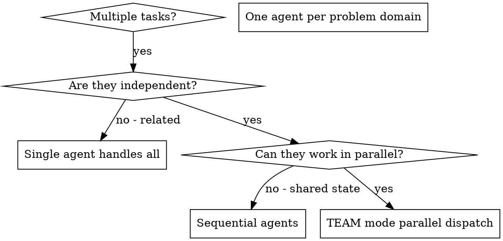

# Dispatching Parallel Agents

## Overview

You delegate tasks to specialized agents using Claude Code's **Agent Teams** feature. Teams provide structured coordination with shared task lists, automatic message delivery, and proper cleanup.

**Prerequisite:** Agent Teams requires experimental feature flag:
```json
// settings.json
{ "env": { "CLAUDE_CODE_EXPERIMENTAL_AGENT_TEAMS": "1" } }
```

**Core principle:** Dispatch one agent per independent problem domain. Let them work concurrently with team coordination.

## When to Use



**Use when:**
- 3+ independent tasks with no shared state
- Multiple subsystems broken independently
- Each problem can be understood without context from others
- No dependencies between tasks

**Don't use when:**
- Tasks are related (fix one might fix others)
- Need to understand full system state
- Agents would interfere with each other (editing same files)

## Team Mode Setup

### Step 1: Check Feature Availability

Before starting, verify the experimental feature is enabled:

```
Check settings.json for CLAUDE_CODE_EXPERIMENTAL_AGENT_TEAMS=1
```

If not enabled, prompt user to add it first.

### Step 2: Create Team

```typescript
// Create a team with descriptive name and purpose
TeamCreate({
  team_name: "parallel-debug-{timestamp}",
  description: "Parallel investigation of independent problems",
  agent_type: "coordinator"
})
```

### Step 3: Create Tasks in Team Task List

Use TaskCreate to add tasks to the team's shared task list:

```typescript
TaskCreate({
  subject: "Fix {problem} in {file}",
  description: "Detailed description of the task",
  activeForm: "Investigating {problem}"
})
```

### Step 4: Spawn Team Members

Use Agent tool to spawn teammates into the team:

```typescript
Agent({
  description: "Fix {problem}",
  prompt: "You are {name} on the team. Task: {detailed_task_description}. Report back when done.",
  subagent_type: "general-purpose",
  name: "{name}",
  team_name: "parallel-debug-{timestamp}"
})
```

**Important:** The `name` field assigns the teammate's identifier, which appears in the team's config at `~/.claude/teams/{team-name}/config.json`.

### Step 5: Monitor and Coordinate

- Messages from teammates are **automatically delivered** to you
- No polling required - wait for completion notifications
- Review task outputs as they arrive
- Handle any conflicts or blockers

### Step 6: Shutdown Team

**Always use the lead (this agent) to orchestrate shutdown:**

```
Ask each teammate to shut down, then clean up the team
```

1. Request shutdown from each teammate via SendMessage or natural language
2. Wait for all teammates to confirm shutdown
3. Execute TeamDelete to clean up resources

**Warning:** Do NOT let teammates run TeamDelete - that can cause resource inconsistency.

## Communication Patterns

### Direct Message

```typescript
SendMessage({
  to: "teammate-name",
  summary: "Task assignment",
  message: "Your task is to fix the abort timing issue..."
})
```

### Broadcast (use sparingly)

```typescript
SendMessage({
  to: "*",
  summary: "Team status update",
  message: "All tasks are now complete, please wrap up"
})
```

Broadcast is expensive (linear cost in team size) - use direct messages when possible.

## Task Management

### Task States

- `pending` - Waiting to be claimed
- `in_progress` - Being worked on
- `completed` - Done

### Task Dependencies

Tasks can have dependencies via `blockedBy`:

```typescript
TaskUpdate({
  taskId: "task-2",
  addBlockedBy: ["task-1"]
})
// task-2 cannot be claimed until task-1 completes
```

When a blocking task completes, its dependents automatically unblock.

## Agent Prompt Structure

Good agent prompts for team dispatch:

1. **Role definition** - Who they are on the team
2. **Task clarity** - What specific problem to solve
3. **Output format** - What to report back

```markdown
# Role: {problem} Investigator

You are {name} on the team investigating {domain}.

## Your Task
Fix the failing tests in {file}:

1. {test-name-1}: {expected behavior}
2. {test-name-2}: {expected behavior}

## Approach
1. Read the test file to understand what's being tested
2. Identify root cause - don't just increase timeouts
3. Fix the underlying issue
4. Run tests to verify

## Constraints
- Focus ONLY on this file
- Do NOT modify unrelated code

## Report
When complete, send me a message with:
- Root cause found
- Changes made
- Test results
```

## Complete Workflow Example

```typescript
// Step 1: Verify feature is enabled
// Check settings.json for CLAUDE_CODE_EXPERIMENTAL_AGENT_TEAMS=1

// Step 2: Create team
TeamCreate({
  team_name: "parallel-debug-001",
  description: "Fixing 3 independent test failures"
})

// Step 3: Create tasks
TaskCreate({
  subject: "Fix abort timing tests",
  description: "agent-tool-abort.test.ts has 3 timing-related failures",
  activeForm: "Investigating abort timing"
})

TaskCreate({
  subject: "Fix batch completion tests",
  description: "batch-completion-behavior.test.ts has 2 failures",
  activeForm: "Investigating batch execution"
})

TaskCreate({
  subject: "Fix race condition test",
  description: "tool-approval-race-conditions.test.ts has 1 failure",
  activeForm: "Investigating race condition"
})

// Step 4: Spawn teammates
Agent({
  description: "Fix abort test failures",
  prompt: "You are abort-dev on the team. Fix agent-tool-abort.test.ts: [details]. Report when done.",
  subagent_type: "general-purpose",
  name: "abort-dev",
  team_name: "parallel-debug-001"
})

Agent({
  description: "Fix batch test failures",
  prompt: "You are batch-dev on the team. Fix batch-completion-behavior.test.ts: [details]. Report when done.",
  subagent_type: "general-purpose",
  name: "batch-dev",
  team_name: "parallel-debug-001"
})

Agent({
  description: "Fix race condition test failure",
  prompt: "You are race-dev on the team. Fix tool-approval-race-conditions.test.ts: [details]. Report when done.",
  subagent_type: "general-purpose",
  name: "race-dev",
  team_name: "parallel-debug-001"
})

// Step 5: Wait for completion notifications
// Teammates will message when done

// Step 6: Shutdown
// "Please shut down now" -> each teammate
// TeamDelete()
```

## Common Mistakes

**❌ No feature flag check:** TeamCreate fails without experimental flag
**✅ Check first:** Verify `CLAUDE_CODE_EXPERIMENTAL_AGENT_TEAMS=1` in settings.json

**❌ Unfocused scope:** "Fix all tests" - agent gets lost
**✅ Specific:** "Fix {file} only" - narrow scope

**❌ No output specification:** "Fix it" - you don't know what changed
**✅ Specific:** "Report root cause and test results"

**❌ Teammate runs cleanup:** Can cause resource inconsistency
**✅ Lead runs cleanup:** Always use lead to execute TeamDelete()

## When NOT to Use Team Mode

**Related failures:** Fixing one might fix others - investigate together first
**Need full context:** Understanding requires seeing entire system
**Exploratory debugging:** You don't know what's broken yet
**Shared state:** Agents would interfere (editing same files)

## Key Benefits of Team Mode

1. **Structured coordination** - Shared task list with dependency support
2. **Automatic messaging** - No polling, messages delivered automatically
3. **Parallelization** - Multiple investigations happen simultaneously
4. **Focus** - Each agent has narrow scope, less context to track
5. **Isolation** - Agents don't interfere with each other
6. **Proper cleanup** - Guaranteed resource cleanup via lead orchestration

## Verification

After agents return:
1. **Review each summary** - Understand what changed
2. **Check for conflicts** - Did agents edit same code?
3. **Run full suite** - Verify all fixes work together
4. **Spot check** - Agents can make systematic errors
