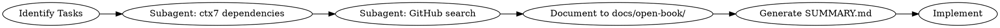

# Open Book Mode

## Overview

**Research first, code second.** Before writing any implementation code, research all dependencies via ctx7 and find real GitHub demos for every task. Never rely on memory or intuition for API usage.

**Core principle:** If you didn't find it in documentation and real code, you don't know it.

## When to Use

- Starting any feature implementation
- Using libraries/frameworks you're not 100% familiar with
- Implementing patterns you haven't used in this codebase
- Any task that requires combining multiple technologies

**Stop:** Before writing any implementation code.

## Workflow



### Step 1: Identify All Tasks

Break the implementation into discrete tasks. Each task = one functional unit that needs research.

### Step 2: Research Dependencies

**REQUIRED: Use subagent for ctx7 research** to avoid context explosion. Use find-docs skill.
Save results to `docs/open-book/research-task-{n}-dep-{name}.md`.

### Step 3: GitHub Search per Task

**REQUIRED: Use subagent for each task** to avoid context explosion. Use mcp__grep__searchGitHub to find real implementations.
Save results to `docs/open-book/research-task-{n}-github-{name}.md`.

### Step 4: Document Scenarios

For each task, document:
- **Wrong approach:** What commonly goes wrong (with code examples)
- **Right approach:** Correct implementation pattern (with code examples)

### Step 5: Generate Summary

Create `docs/open-book/SUMMARY.md` that references all research files with `@filename` links. Include:
- Each task's findings (wrong vs right)
- Key APIs and gotchas
- Reference links to source code

Only after research is complete and documented.

## Common Mistakes

| Wrong | Right |
|-------|-------|
| "I know how to use this library" | Research every API call via ctx7 |
| "I'll figure it out as I code" | Find GitHub demo first |
| "This task is simple, no research needed" | Every task needs at least one GitHub reference |
| Skipping ctx7 for well-known libraries | ctx7 even for React, Next.js, etc. (APIs change) |
| Implementing based on memory | Real code found in GitHub |

## Red Flags - STOP

- Writing code before research is complete
- "This should work" without verification
- Skipping GitHub search because "it's obvious"
- Implementing logic without finding a reference implementation
- Using APIs without reading current documentation

**All of these mean: Research first, code second.**

## Quick Reference

1. Identify all tasks
2. Research dependencies in subagent → save to `docs/open-book/research-task-{n}-dep-{name}.md`
3. GitHub search in subagent → save to `docs/open-book/research-task-{n}-github-{name}.md`
4. Generate `docs/open-book/SUMMARY.md` referencing all files
5. Implement only after research complete

## Output Format

After research, document:

```
## Task: [Name]

**ctx7 findings:**
- API: [specific API used]
- Gotcha: [common mistake]

**GitHub references:**
- [repo/path]: [what it does]

**Wrong approach:**
```code that breaks
```

**Right approach:**
```working code
```
```